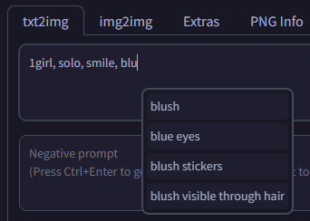

# SD Webui Auto Complete
This is an Extension for the [Automatic1111 Webui](https://github.com/AUTOMATIC1111/stable-diffusion-webui), which automatically completes and suggests **Booru Tags** while typing.

> Compatible with [Forge](https://github.com/lllyasviel/stable-diffusion-webui-forge)

> [!TIP]
> **Booru Tags** refers to the comma-separated tags used by anime image boards; see this post of [Hatsune Miku](https://safebooru.donmai.us/posts/135361) for example

### Elephant in the Room

**Q:** How's this different from [tagcomplete](https://github.com/DominikDoom/a1111-sd-webui-tagcomplete)? Why not just use that instead?

**A:** Yes, you should use `tagcomplete` instead. However, if you somehow, like me, felt that `tagcomplete` is too ~~bloated~~ feature-rich, then this Extension is right for you!

### Features

- The suggestions are strictly triggered by **keyboard inputs** instead of **prompt editions**
    - Meaning, the suggestions will only ever show up when you are actually typing
    - Extension that edits the prompts *(**eg.** [prompt-format](https://github.com/Haoming02/sd-webui-prompt-format))* will **not** trigger the suggestions
- Fast & Lightweight
    - Initialization takes `50ms`
    - Parsing suggestions takes `1ms`
- Configure the behaviors in the `Auto Complete` section under the <ins>System</ins> category of the **Settings** tab

### Tags

- A `tags.csv` is included by default, containing every tag that has at least `128` posts from [Danbooru](https://safebooru.donmai.us/)
- You can create a `custom.csv` to manually include more tags
- A `dl.py` script is included, if you want to customize the default `tags.csv`
